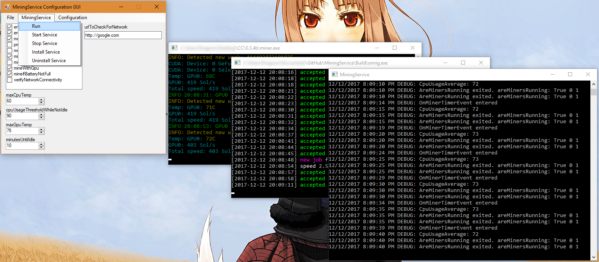
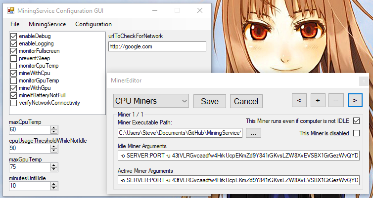

# MiningService
TopShelf service and userland idle monitor for easy crypto mining.

This is an idle miner software; it should detect whether your computer is idle or locked and mine accordingly based on your settings. Most features are implemented and (should be) working with the current release.

#### MinerService running as a non-service


#### GUI, with Miner Editor


#### Notification


## How to use
First, download the newest version from the Releases page, or compile it yourself. VS 2017 recommended.

Run MiningService.exe once, so it can generate the default MinerService.json configuration file.
Open MinerService.json in a text editor (Notepad ++ recommended), and edit the settings to your liking.

After modifying the settings, you can test them by running MiningService.exe. This will cause it to run as a Console window.
After you are satisfied that your settings work, run `install.bat` to install MiningService as a Windows service, and then run `start.bat` to start the MiningService. If things went well, you should see a notifaction above your taskbar icons telling you that it is running.

If you want to stop the service, run `stop.bat`. You can also use an elevated command prompt for all of these.
`MiningService.exe start`
`MiningService.exe stop`
`MiningService.exe uninstall`. Or with the Service Control manager built into Windows: `sc start MiningService` `sc stop MiningService`.

#### MinerService.json
Below CPU miner is XMRIG, and GPU miner is EWBF.
```
{
  "ignoredFullscreenApps": [
    "explorer",
    "LockApp"
  ],
  "cpuMiners": [
    {
      "executable": "C:\\Miners\\xmrig.exe",
      "idleArguments": "-o SERVER:PORT -u WALLET -p x -k --safe",
      "activeArguments": "-o SERVER:PORT -u WALLET -p x -k --max-cpu-usage=50",
      "mineWhileNotIdle": true,
      "minerDisabled": false
    }
  ],
  "gpuMiners": [
    {
      "executable": "C:\\UMiners\\EWBFMiner.exe",
      "idleArguments": "--server SERVER --port PORT --user WALLET --pass x --cuda_devices 0 --fee 0",
      "activeArguments": "--server SERVER --port PORT --user WALLET --pass x --cuda_devices 0 --fee 0",
      "mineWhileNotIdle": false,
      "minerDisabled": false
    }
  ],
  "enableDebug": false,
  "enableLogging": true,
  "monitorFullscreen": true,
  "preventSleep": false,
  "monitorCpuTemp": false,
  "mineWithCpu": true,
  "maxCpuTemp": 60,
  "cpuUsageThresholdWhileNotIdle": 90,
  "monitorGpuTemp": false,
  "mineWithGpu": true,
  "maxGpuTemp": 75,
  "mineIfBatteryNotFull": true,
  "verifyNetworkConnectivity": false,
  "urlToCheckForNetwork": "http://google.com",
  "minutesUntilIdle": 10
}
```

#### Fullscreen Programs
| Ignored Fullscreen App |  Description |
| ------------- | ------------- |
| explorer  | The user's desktop is sometimes detected as a fullscreen app. This entry prevents it.  |
| LockApp  | When the desktop is locked, this app is detected as a fullscreen app. This entry prevents it.  |

You can enter your own apps here, or right-click on the tray icon to ignore the last fullscreen app that was detected.

#### CPU/GPU Miners
| Miner Item  | Values  |  Description |
| ------------- | ------------- | ------------- |
| executable  | miner.exe  | Path to mining executable. If not in same directory, use double backslashes '\\\\'  |
| idleArguments  | Miner specific | When the computer is detected as Idle. Arguments passed to the miner's executable at launch. Miner software specific.  |
| activeArguments  | Miner specific | When a user is currently using the computer. Arguments passed to the miner's executable at launch. Miner software specific.  |
| mineWhileNotIdle  | true/false  | If set to true, the computer uses the 'activeArguments' to mine while a user is detected.  |
| minerDisabled  | true/false  | If set to true, this miner will not be used.  |

#### Configuration
| Configuration Item  | Values  |  Description |
| ------------- | ------------- | ------------- |
| enableDebug  | true/false  | Output debug information to console and log file.  |
| enableLogging  | true/false  | Enable logging to COMPUTERNAME.txt in same directory.  |
| minutesUntilIdle  | true/false  | Time, in minutes, before you are detected as idle. Minimum 1. |
| monitorFullscreen  | true/false  | Whether to enable monitoring of Fullscreen apps or not.  |
| mineIfBatteryNotFull  | true/false  | Whether to mine on a computer when the battery is not detected as full.  |
| verifyNetworkConnectivity  | true/false  | The address to check for network connectivity before mining is started. (not implemented yet) |
| urlToCheckForNetwork  | URL/Web/IP address  | URL used for verifying network connectivity (not fully implemented) |
| mineWithCpu  | true/false  | Whether to enable mining with the programs in the cpuMiners configuration.  |
| monitorCpuTemp  | true/false  | Whether to monitor the CPU temperature or not. (not implemented yet)  |
| maxCpuTemp  | 0-90  | Maximum CPU temperature before mining stops. (not implemented)  |
| cpuUsageThresholdWhileNotIdle  | 0-100; 0 to disable  | Maximum CPU usage percent before mining is stopped while a user is present.  |
| mineWithGpu  | true/false  | Whether to enable mining with the programs in the gpuMiners configuration. |
| monitorGpuTemp  | true/false  | Whether to monitor the GPU temperature or not. (not implemented yet)  |
| maxGpuTemp  | 0-100  | Maximum GPU temperature before mining stops. (not implemented yet) |

# How it works

### MiningService

Runs as a Windows Service, and starts user-defined (crypto ideally, but anything, really) programs in the SYSTEM user's context.
This allows us easy access to large pages (necessary for fast CPU mining with Monero), as well as easily hiding the mining software from display.
If no logged in user is found, it will launch the user-defined software for the appropriate condition.

### IdleMon

Runs in the current logged in user's Desktop environment, automatically started by the MiningService using CreateProcessAsUser.
IdleMon starts a NamedPipe server which MiningService connects to and, using that pipe, tells the service whether the user is idle or if the user chooses, through a task tray icon, to pause mining.

## Compiling
Visual Studio 2017 is required. It should be as simple as opening the MiningService solution and doing a Build. You may need to restore Nuget packages by right-clicking on the solution and selecting "Restore nuget packages" if it does not restore them automatically on build.

## Current todo list
- [X] Most things work!
- [X] Load configuration from JSON file
- [X] Load user-defined programs for different conditions
- [X] MiningService -> IdleMon communcation and notifications
- [X] Stealth mode, which hides the task tray options (you must recompile it with the stealthMode option set to true in IdleMon)
- [X] Debug/Log output, configurable from configuration JSON
- [X] Monitor for fullscreen programs with IdleMon and stop mining if detected
- [X] Whitelist for fullscreen apps loaded from configuration
- [X] Monitor CPU usage and stop non-Idle mining if over a set threshold
- [X] Average the CPU usage over a period of time longer than 1s, and stop programs if usage is too high while not idle
- [X] GUI to easily modify configuration JSON
- [ ] Monitor GPU temperature and stop programs if over a threshold
- [ ] Monitor CPU temperature and stop programs if over a threshold

### Credits
https://github.com/acdvorak/named-pipe-wrapper (I've modified it to keep CPU usage lower, check the PRs for example)
https://github.com/murrayju/CreateProcessAsUser (I was not able to get command args working on Win10)
https://stackoverflow.com/questions/3743956/is-there-a-way-to-check-to-see-if-another-program-is-running-full-screen
Newtonsoft.Json
TopShelf
And probably one or two I'm not thinking of.

### Donations
I worked a lot on this, but there is no fee for using it! If you appreciate my efforts, you can send a donation to any of these addresses.

 * BTC: 1QDVJmxyqMzA5nQghKMBCFVk8K41nSoz5b
 * ETH: 0xa62a11710cc44Bd54D66CbCcF710a36716BF04CE
 * Monero: 43tVLRGvcaadfw4HrkUcpEKmZd9Y841rGKvsLZW8XvEVSBX1GrGezWvQYDdoNwNHAwTqSyK7iqyyqMSpDoUVKQmM43nzT72
 * UBQ: 0x0c0ff71b06413865fe9fE9a4C40396c136a62980
 * DCR: DsfPh3tpa7nd8sExYvxWbijzjUH1zJ34dgu
 * HUSH: t1ZHrvmtgd3129iYEcFm21XMv5ojdh2xmsf
 * ZEN: znTmG8nid2LEYgw8cub17Q7briGATan4c68
 
